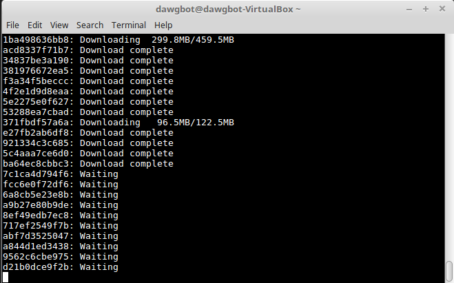
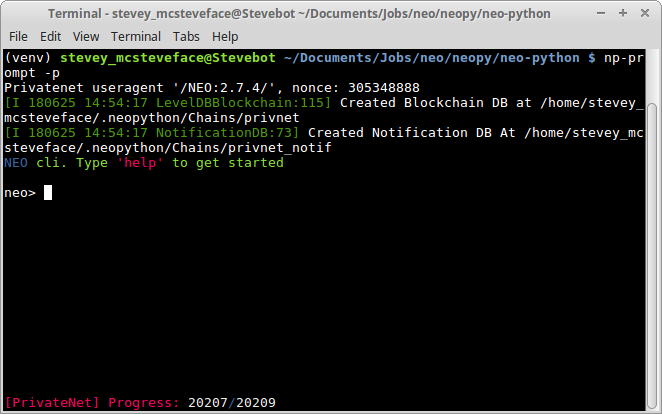

# NEO Smart Contract Workshop (Part 1)
*by [Steve](https://github.com/HandsomeJeff) for NEO*

This workshop assumes intermediate knowledge of the command line.

This portion involves installing and setting up the environment.
___

### Workshop Details
**When**: Sunday, 1 Jul 2018. 1:30 PM - 5:30 PM.</br>
**Where**: 太库北京孵化器</br>
**Who**: NEO

### Questions
Please raise your hand any time during the workshop or email your questions to [me](mailto:yefan0072001@gmail.com) later.

### Errors
For errors, typos or suggestions, please do not hesitate to [post an issue](https://github.com/HandsomeJeff/NEO-smart-contract-workshop). Pull requests are very welcome! Thanks!

___

## Task 0 - Install Pre-requisites
Before you start, make sure you have the following:
1. **Linux/Mac Operating System**
2. **Docker**
3. **Python3.6**
4. **leveldb**

For Docker, try running the following in terminal:
```
sudo curl -sSL https://get.docker.com/ | sh
sudo apt-get update && apt-get upgrade
```

If you don't have Python 3.6, and have no idea how to install it, run the following commands:
```
sudo apt-get install software-properties-common python-software-properties
sudo add-apt-repository ppa:deadsnakes/ppa
sudo apt-get update
sudo apt-get upgrade
sudo apt-get install python3.6 python3.6-dev python3.6-venv python3-pip libleveldb-dev libssl-dev g++
```


## Task 1 - Getting Started

In this session, we'll be setting up a local private blockchain which allows us to upload and execute smart contracts.

This will be hosted entirely on our own machines!

The process will go in the following order:
1. Setting up the Docker Container
2. Running NEO Python


#### 1.1 Setting up the Docker Container
Pull the latest image from Docker hub `sudo docker pull cityofzion/neo-privatenet`.



Be patient! On the first time round it might take a while to start up.

Start the container with the command
`sudo docker run --rm -d --name neo-privatenet -p 20333-20336:20333-20336/tcp -p 30333-30336:30333-30336/tcp cityofzion/neo-privatenet`.

*You can open bash within the container with* `sudo docker exec -it neo-privatenet /bin/bash`.

*Stop the container with* `sudo docker rm -f neo-privatenet`.

#### 1.2 Running NEO Python
Navigate to a directory of your choice and download the neo-python repository with `git clone https://github.com/CityOfZion/neo-python.git`

Go into the neo-python folder with `cd neo-python`.

Create and start a virtual environment so our setup does not interfere with the rest of our machine.
```
python3.6 -m venv venv
source venv/bin/activate
```

Install neo-python.
```
pip install -r requirements.txt
pip install -e .
```

Start neo-python with `np-prompt -p`.
You should see something like this:




## Acknowledgements

Special Thanks to [Jonboy](https://github.com/jonathanlimwj) and [Chris Hager](https://github.com/metachris).
